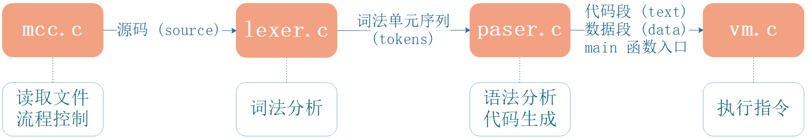
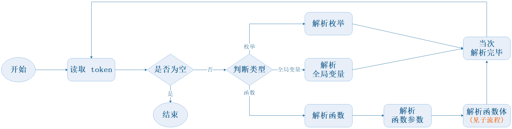
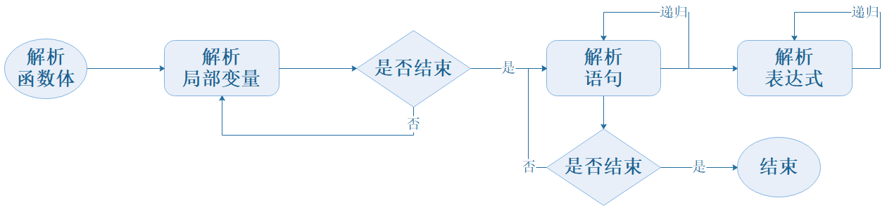

# mcc

[mcc 项目地址](https://github.com/patricklaux/mcc)

mcc (mini c compiler) 是一个小型的 C 编译器，仅支持有限的 C 语言特性，思路来源于 C4。

C4 仅用了少量代码和有限特性实现了自举（1个文件4个函数），非常精巧但却晦涩难懂。

正所谓：编译过程一遍过，递归调用循环调，全局变量随处变，类型转换强制转。

mcc 则走的是相反的路，完全以简单可理解为目标。当然，不可避免地，代码量会大许多，大概有1700多行。

如果你刚刚开始学习编译原理，希望真切地了解编译器前端和虚拟机运行，而不只是书上的文法和期末的试卷，那么可以考虑先看看 mcc，然后再去看 TCC 之类的代码。

> 注：C4 是500多行代码。

## 1. 编译运行

```bash
# 下载源码
git clone git@github.com:patricklaux/mcc.git

# 编译 mcc
gcc -o mcc ./src/mcc/lexer.c ./src/mcc/parser.c ./src/mcc/vm.c ./src/mcc/mcc.c

# 使用 mcc 运行测试代码
./mcc [-s] [-d] ./src/test/test1.c
```

**提示**：

1. 除了直接用 gcc 编译，也可以用 cmake，这里不再赘述。
2. -s 和 -d 为可选参数： -s 打印生成的指令，但不执行；-d 运行并打印整个运行过程执行的指令。
3. Windows 10 (MinGW_w64 11.0) 和 Ubuntu 22.04 (gcc 11.4.0) 均可正常编译运行。

## 2. 概要介绍


### 2.1. 流程

为了便于理解，特意画了几张流程图，按图索骥，相信更容易理解。

#### 2.1.1. 主流程



mcc 将整个编译运行过程拆分为 4 个主要文件，具体流程和相应功能如上图所示。

我们也可以看到，mcc 的编译过程是分为两趟，词法分析是一趟，语法分析和代码生成是一趟。

根据功能流程分层建立文件的好处是显而易见的，每一层所需要关注的变量减少，输入和输出都变得更加清晰。

> 注：C4 是一个文件一趟编译。

#### 2.1.2. 语法分析

整个编译程序，语法分析(parser) 的逻辑相对复杂，所以再画两张流程图。



对于一个 C 语言文件，最外层可能会有预处理语句(#)，注释(//)，枚举(enum)，结构体(struct)，联合体(union)，全局变量(int, char, ……)，函数(void, int, char,……) 等。

mcc 对于预处理语句和注释是直接忽略的，在词法分析环节只要发现 # 或 // 开头，就跳过该行。

语法分析环节，也只解析枚举、全局变量、和函数这三类，并且只支持 char, int, ptr(指针) 三种数据类型（所以说是C语言的子集）。

整个语法分析过程，就是“读取token，根据类型进行解析并生成相应指令”的大循环。

**子流程：解析函数体**



函数体内部，先循环解析全部局部变量声明，然后才开始解析语句。因此，所有局部变量声明必须写在函数体的顶部。

mcc 主要支持七种语句，if, while, …… 等，这里不再展开详谈，建议直接下载代码进行调试，相信会有更直观的理解。

### 2.2. 符号表

mcc 中，符号表分为全局符号表和局部符号表。

全局符号表只有一个，用以保存枚举名、全局变量名和函数名信息。

局部符号表同样只有一个，用以保存函数参数名和本地变量名信息。每当一个函数解析完毕，就会将局部符号表中的信息清除。局部符号表清除操作是将索引归 0，因此非常快速。

另，因为 mcc 不支持代码块内声明变量，所以只需一个局部符号表。如果要支持代码块内声明变量，那么就需要分层创建多个符号表。

> C4 的符号表只有一个，但有一个字段来标记是全局变量还是局部变量。当局部变量与全局变量同名时，需先将全局变量的相关信息迁移，再保存本地变量信息，函数解析结束后，又再将全局变量信息移回，相当麻烦。

### 2.3. 其它

我一直认为，只要一个程序能够画出清晰的流程图，并且代码能与流程图一一对应，那么理解起来就是相当容易的。

因此，这里不再展现更多细节，很多东西一看代码就懂，但如果用文字来描述，即使费很大的篇幅也难于解释明白。

另外，我在代码中加了很多注释，所以更建议直接将源码下载下来查看和调试。

## 3. 结语
如果要实现自举，需要支持 struct 结构体、switch 语句、函数前向声明……等语言特性，与及多文件编译等。

难倒是不难，但代码将会不可避免地变得臃肿复杂，与此项目“简单可理解”的目标相违背，因此并无计划去实现。

其实，我更感兴趣的是设计实现一个 c with class 的简单语言，与及将源码直接编译成 x86_64 平台的可执行文件……

最后，希望这个小项目能够对大家有所帮助，如有错漏欢迎指正。